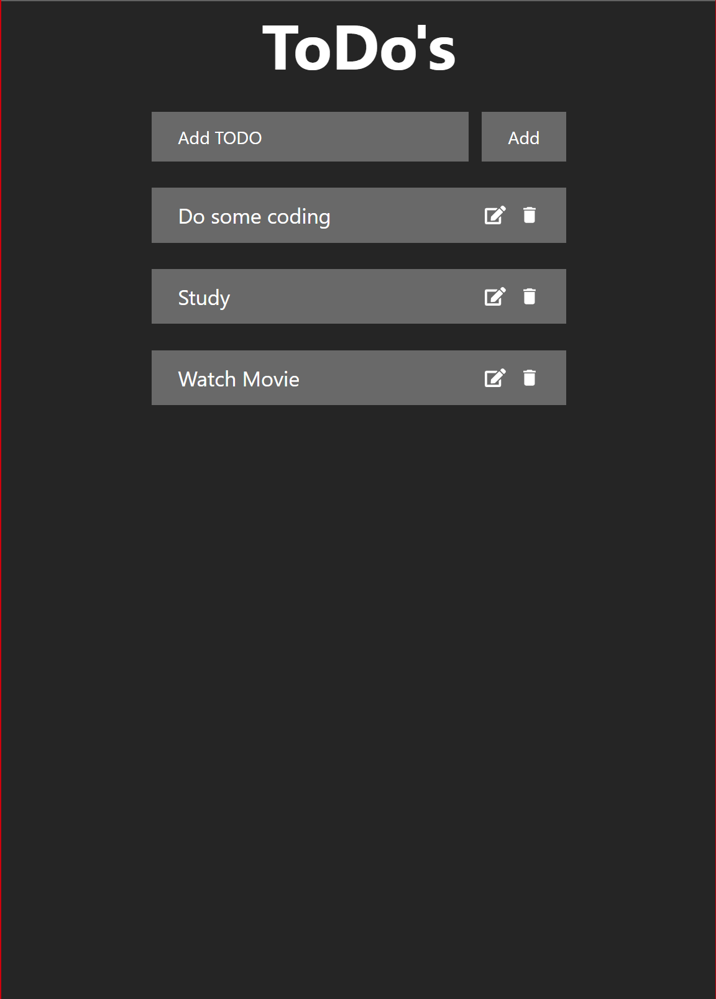
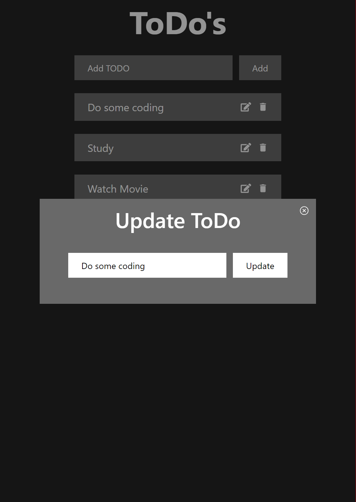

# 📝 MERN TODO App

## 🚀 Description
Simplifies task management using MongoDB, Express.js, React, and Node.js (MERN stack).

## ✨ Features
- **Efficient Task Management:** Seamlessly organize tasks with CRUD operations (Create, Read, Update, Delete) for enhanced productivity.
- **Real-time Updates:** Experience instant updates without page reloads, ensuring smooth task management.
- **Intuitive User Interface:** Enjoy a clean and intuitive UI design, offering a hassle-free task management experience.
- **Responsive Design:** Access the application seamlessly across various devices, including desktops, tablets, and smartphones.

## 🛠️ Technologies Used
- **Frontend:** React.js, Axios, React Icons
- **Backend:** Node.js, Express.js
- **Database:** MongoDB
- **Deployment:** Heroku (or your preferred hosting platform)

## 📋 Setup Instructions
1. **Clone the repository:** `git clone https://github.com/suyashpurwar1/ToDo`
2. **Navigate to the project directory:** `cd MERN-TODO-App`
3. **Install dependencies:** `npm install`
4. **Start the server:** `npm run dev`

## 🖼️ Screenshots

  
  

